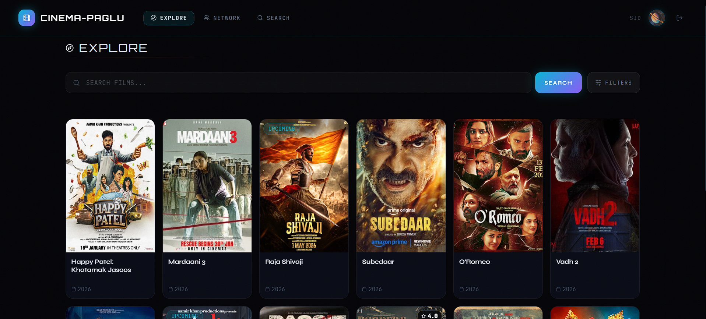
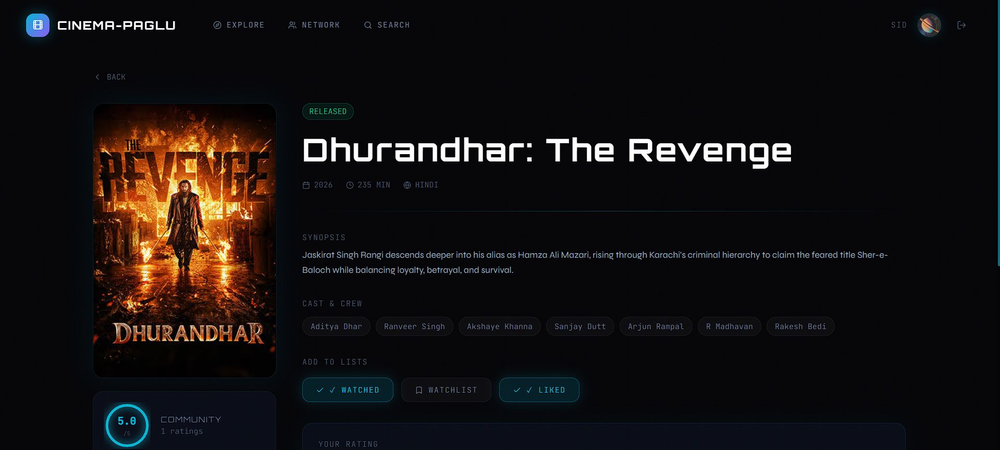
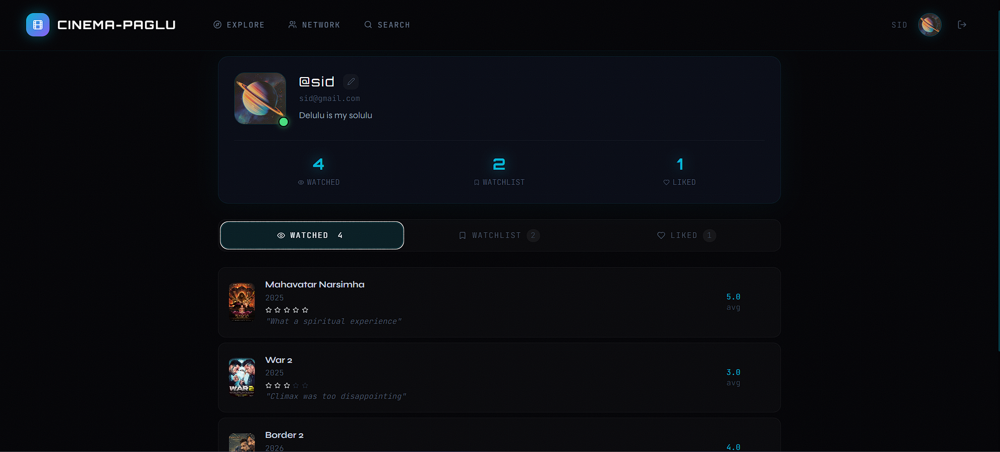
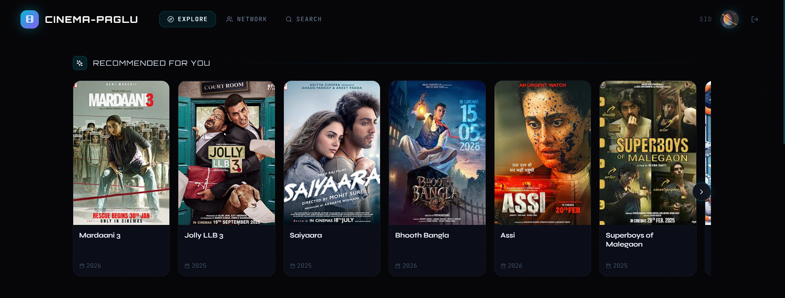

<div align="center">

# 🎬 CINEMA-PAGLU

### *Your Universe. Your Watchlist. Your Reviews. Evolved.*

<br/>

[](https://spring.io/projects/spring-boot)
[](https://openjdk.org/)
[](https://react.dev/)
[](https://neon.tech/)
[](https://www.docker.com/)
[](https://aws.amazon.com/)
[](https://jwt.io/)
[](LICENSE)
[](https://github.com/features/actions)

<br/>

> **A full-stack movie social platform** — track, rate, review, and discover films with a content-based recommendation engine and a futuristic sci-fi HUD aesthetic.  
> Built end-to-end as a production-grade portfolio project targeting Amazon SDE1.

<br/>

🌐 **Live Demo:** [`http://13.51.6.255`](http://13.51.6.255) &nbsp;
</div>

---

## 📖 Overview

**CINEMA-PAGLU** is a Letterboxd/MyAnimeList-inspired movie tracking and social platform, built independently from scratch. It demonstrates a complete production-grade engineering workflow — from thoughtful database schema design and RESTful API development, to a React frontend with advanced animations, a pure-Java recommendation engine, CI/CD via GitHub Actions, and Docker + AWS EC2 deployment.

> ⚡ *Not just a CRUD app. Every design decision has an intentional engineering reason behind it.*

---

## ✨ Features

### 🔐 Authentication & Authorization
- Stateless **JWT authentication** — every request carries its own identity proof
- **Role-based access control** — `USER` / `ADMIN` roles via Spring Security + `@PreAuthorize`
- BCrypt password hashing — no plain-text secrets, ever

### 🎥 Movie Discovery
- Browse, search by title, filter by genre, sort by year or rating
- Server-side pagination for large datasets
- Community **average rating** auto-calculated and stored on every submission
- Movie detail pages with cast, trailers, and member reviews

### 📋 Personal Tracking
- **Three simultaneous lists per user** — Watched, Watchlist, Liked
  - A movie can exist in multiple lists at once (architectural decision: single normalized `user_movie_list` table with an enum discriminator)
- 1–5 **star rating** with written reviews on watched movies
- Full list management — add, update, remove entries

### 🤖 Recommendation Engine
- Pure-Java **content-based filtering** — no ML framework dependency
- Scores unwatched movies by **genre** (weight 3) + **cast** (weight 2) + **language** (weight 1)
- Preferences derived from the user's highly-rated watches
- **Cold-start fallback** — top-rated movies served when watch history is sparse

### 👥 Social Layer
- **Friendship system** — send, accept, reject, and block requests
- View friends' public lists and activity
- Member reviews visible to all users on every movie page

### 🛠️ Admin Panel
- Full **CRUD** for Movies, Genres, and Cast Members
- Role-protected endpoints — only `ADMIN` can write; all users can read

### ⚙️ Engineering Extras
- **Swagger UI** — interactive API documentation at `/swagger-ui.html` with JWT bearer auth
- **GlobalExceptionHandler** — centralized error handling across all 8 modules
- **SLF4J + Logback** logging throughout all service layers
- **CI/CD pipeline** — GitHub Actions: build → test → Dockerize → deploy, ~2.5 min end-to-end

---

## 🏗️ Architecture & Workflow

### System Layers

```
┌──────────────────────────────────────────────────────────┐
│                     React 18 Frontend                    │
│        (Vite + Tailwind + Framer Motion + Axios)         │
└─────────────────────────┬────────────────────────────────┘
                          │ HTTP / REST (JSON)
┌─────────────────────────▼────────────────────────────────┐
│              Spring Boot Application (Java 21)            │
│                                                          │
│  ┌────────────┐  ┌────────────┐  ┌────────────────────┐  │
│  │ Controller │→ │  Service   │→ │    Repository      │  │
│  │  (REST)    │  │ (Business) │  │ (Spring Data JPA)  │  │
│  └────────────┘  └────────────┘  └────────────────────┘  │
│          ↑                                               │
│  JwtAuthFilter → SecurityConfig → SecurityContext        │
└─────────────────────────┬────────────────────────────────┘
                          │ JDBC / Hibernate ORM
┌─────────────────────────▼────────────────────────────────┐
│           PostgreSQL (NeonDB — Cloud Hosted)              │
└──────────────────────────────────────────────────────────┘
```

### Security Filter Chain

```
HTTP Request
    │
    ▼
JwtAuthFilter
    ├── Reads: Authorization: Bearer <token>
    ├── Extracts email via JwtUtil.extractEmail()
    ├── Loads user from DB via CustomUserDetailsService
    └── Validates token signature + expiry → sets SecurityContext
    │
    ▼
SecurityConfig
    ├── Public endpoint? → Allow through
    ├── Authenticated required? → 401 if missing token
    └── ADMIN role required? (@PreAuthorize) → 403 if unauthorized
    │
    ▼
Controller → Service → Repository → Response DTO
```

### End-to-End Request Flow Example

```
User clicks "Add to Watched"
    │
    ▼
React → POST /api/user-movies (Axios auto-attaches Bearer token)
    │
    ▼
JwtAuthFilter validates token
    │
    ▼
UserMovieListController → @Valid checks DTO
    │
    ▼
UserMovieListService.addToList()
    ├── Checks movie exists
    ├── Checks for duplicate in same list
    └── Saves row to DB
    │
    ▼
UserMovieListRepository executes INSERT via Hibernate
    │
    ▼
201 Created → UserMovieListResponse DTO as JSON
    │
    ▼
React updates local state instantly — no page reload
```

### CI/CD Pipeline

```
git push origin main
    │
    ▼
GitHub Actions Triggered
    │
    ├── [Job 1] Build Backend  ──┐
    │   Java 21 + Maven          │  (parallel)
    ├── [Job 2] Build Frontend ──┘
    │   Node 18 + Vite
    │
    ▼  (both must pass)
    │
    ├── [Job 3] Build & Push Docker Images
    │   → siddheshkaremore/cinema-paglu-backend:latest
    │   → siddheshkaremore/cinema-paglu-frontend:latest
    │
    ▼
    ├── [Job 4] Deploy to EC2 (~19s)
    │   SCP compose file → SSH into EC2
    │   Write .env from GitHub Secrets
    │   docker-compose pull → down → up -d
    │   docker image prune -f
    │
    ▼
✅ Live at http://13.51.6.255  (~2m 30s total)
```

---

## 🛠️ Tech Stack

### Backend

| Layer | Technology | Purpose |
|---|---|---|
| Framework | Spring Boot 3.x | Core REST API, DI, Security |
| Language | Java 21 | Primary backend language |
| Database | PostgreSQL (NeonDB) | Relational persistence |
| ORM | Spring Data JPA + Hibernate | Entity mapping, zero raw SQL |
| Security | Spring Security + JWT (JJWT) | Stateless auth, RBAC |
| Build | Maven | Dependency mgmt, build lifecycle |
| API Docs | SpringDoc OpenAPI (Swagger) | Interactive API explorer |
| Logging | SLF4J + Logback | Service-layer observability |
| Boilerplate | Lombok | Eliminates getters/setters/builders |

### Frontend

| Layer | Technology | Purpose |
|---|---|---|
| Framework | React 18 + Vite | Component-based UI, fast HMR |
| Animations | Framer Motion | 3D card tilt, spring physics, transitions |
| Styling | Tailwind CSS | Utility-first, sci-fi HUD aesthetic |
| HTTP Client | Axios | API calls with interceptors for JWT |
| Routing | React Router DOM v6 | Client-side navigation, route protection |
| Notifications | React Toastify | Success/error toast messages |
| Icons | Lucide React | Icon system throughout UI |
| Typography | Orbitron + Syne + JetBrains Mono | Futuristic font system |

### Infrastructure & DevOps

| Component | Technology | Details |
|---|---|---|
| Containerization | Docker (multi-stage builds) | ~25MB Nginx frontend image |
| Orchestration | Docker Compose | EC2-hosted, health-check gated startup |
| CI/CD | GitHub Actions | Auto build → push → deploy on every push |
| Cloud | AWS EC2 t2.micro | Amazon Linux 2, free-tier eligible |
| Container Registry | Docker Hub | Pre-built images pulled on deploy |
| Database Host | NeonDB | Serverless cloud PostgreSQL, SSL enforced |

---

## 📂 Project Structure

```
cinema/
├── .github/
│   └── workflows/
│       └── ci-cd.yml               # Full CI/CD pipeline definition
│
├── src/main/java/com/cinemapaglu/
│   ├── controller/                 # REST endpoints (8 controllers)
│   │   ├── AuthController.java
│   │   ├── MovieController.java
│   │   ├── GenreController.java
│   │   ├── CastMemberController.java
│   │   ├── UserController.java
│   │   ├── UserMovieListController.java
│   │   ├── FriendshipController.java
│   │   └── RecommendationController.java
│   │
│   ├── service/                    # Business logic layer
│   │   ├── AuthService.java
│   │   ├── MovieService.java
│   │   ├── RecommendationService.java  ← content-based engine
│   │   └── ...
│   │
│   ├── repository/                 # Spring Data JPA repos
│   ├── entity/                     # JPA-mapped DB entities
│   │   ├── User.java
│   │   ├── Movie.java
│   │   ├── UserMovieList.java      ← core normalized table
│   │   ├── Friendship.java
│   │   └── ...
│   │
│   ├── dto/
│   │   ├── request/                # Incoming API payloads
│   │   └── response/               # Outgoing API response objects
│   │
│   ├── security/                   # JWT + Spring Security config
│   │   ├── JwtUtil.java
│   │   ├── JwtAuthFilter.java
│   │   ├── CustomUserDetailsService.java
│   │   └── SecurityConfig.java
│   │
│   ├── exception/
│   │   └── GlobalExceptionHandler.java  ← centralized error handling
│   │
│   └── config/
│       └── SwaggerConfig.java
│
├── frontend/
│   ├── src/
│   │   ├── components/             # Reusable UI components
│   │   ├── pages/                  # Route-level page components
│   │   ├── context/                # React context (auth state)
│   │   ├── api/                    # Axios instances + API calls
│   │   └── main.jsx
│   │
│   ├── Dockerfile                  # Multi-stage: Node build → Nginx serve
│   ├── nginx.conf                  # SPA fallback + API proxy to :8080
│   └── vite.config.js
│
├── Dockerfile                      # Multi-stage: Maven build → JRE Alpine
├── docker-compose.yml              # Orchestrates backend + frontend
├── .dockerignore
└── pom.xml
```

---

## ⚡ Getting Started

### Prerequisites

| Tool | Version |
|---|---|
| Java (JDK) | 21+ |
| Maven | 3.9+ |
| Node.js | 18+ |
| Docker + Docker Compose | Latest |
| PostgreSQL | 15+ (or NeonDB account) |

---

### 🐳 Option A — Run with Docker Compose (Recommended)

**1. Clone the repository**
```bash
git clone https://github.com/Siddhesh1732/CinemaApp.git
cd cinema
```

**2. Create your `.env` file** in the project root:
```env
DB_URL=jdbc:postgresql://<your-db-host>/<your-db-name>?sslmode=require
DB_USER=your_db_username
DB_PWD=your_db_password
JWT_SECRET=your_super_secret_key_minimum_32_chars
```

**3. Pull and run**
```bash
docker-compose pull
docker-compose up -d
```

**4. Access the app**

| Resource | URL |
|---|---|
| Frontend | `http://localhost` |
| Backend API | `http://localhost:8080/api` |

---

### 🔧 Option B — Run Locally (Dev Mode)

**Backend**
```bash
# Set environment variables (or use application.properties)
export DB_URL=jdbc:postgresql://localhost:5432/cinema
export DB_USER=postgres
export DB_PWD=yourpassword
export JWT_SECRET=your_minimum_32_char_secret_key_here

cd cinema
mvn clean package -DskipTests
mvn spring-boot:run
```

**Frontend**
```bash
cd cinema/frontend
npm install
npm run dev
# Runs at http://localhost:5173
# Vite dev server proxies /api/* → http://localhost:8080
```

---

### 🔑 First Run

1. Register a new account via `POST /api/auth/register`
2. Login via `POST /api/auth/login` — copy the JWT token from the response
3. Authorize in Swagger UI (click the 🔒 lock icon) and paste: `Bearer <your_token>`
4. To create an ADMIN user, update the `role` column directly in the DB: `UPDATE users SET role = 'ADMIN' WHERE email = 'admin@example.com';`

---

## 🔌 API Endpoints

### Authentication
| Method | Endpoint | Auth | Description |
|---|---|---|---|
| `POST` | `/api/auth/register` | ❌ Public | Register new user |
| `POST` | `/api/auth/login` | ❌ Public | Login, receive JWT |

### Movies
| Method | Endpoint | Auth | Description |
|---|---|---|---|
| `GET` | `/api/movies` | ✅ User | Browse all movies (paginated, filterable) |
| `GET` | `/api/movies/{id}` | ✅ User | Get movie detail with cast |
| `POST` | `/api/movies` | 🔒 Admin | Create movie |
| `PUT` | `/api/movies/{id}` | 🔒 Admin | Update movie |
| `DELETE` | `/api/movies/{id}` | 🔒 Admin | Delete movie |

### User Movie Lists
| Method | Endpoint | Auth | Description |
|---|---|---|---|
| `POST` | `/api/user-movies` | ✅ User | Add movie to list (WATCHED / WATCHLIST / LIKED) |
| `GET` | `/api/user-movies/my-lists` | ✅ User | Get all 3 lists for current user |
| `PUT` | `/api/user-movies/{id}/rate` | ✅ User | Rate + review a watched movie |
| `DELETE` | `/api/user-movies/{id}` | ✅ User | Remove from list |
| `GET` | `/api/movies/{id}/reviews` | ✅ User | Get all community reviews for a movie |

### Recommendations
| Method | Endpoint | Auth | Description |
|---|---|---|---|
| `GET` | `/api/recommendations` | ✅ User | Get personalized movie recommendations |

### Friendships
| Method | Endpoint | Auth | Description |
|---|---|---|---|
| `POST` | `/api/friendships/request/{userId}` | ✅ User | Send friend request |
| `PUT` | `/api/friendships/{id}/accept` | ✅ User | Accept request |
| `PUT` | `/api/friendships/{id}/reject` | ✅ User | Reject request |
| `PUT` | `/api/friendships/{id}/block` | ✅ User | Block user |
| `GET` | `/api/friendships` | ✅ User | Get all friends |

### Genres & Cast (Admin)
| Method | Endpoint | Auth | Description |
|---|---|---|---|
| `GET` | `/api/genres` | ✅ User | List all genres |
| `POST` | `/api/genres` | 🔒 Admin | Add genre |
| `GET` | `/api/cast-members` | ✅ User | List cast members |
| `POST` | `/api/cast-members` | 🔒 Admin | Add cast member |

---

## 📸 Screenshots / Demo

> 🚧 *Screenshots coming soon — UI is live at [`http://13.51.6.255`](http://13.51.6.255)*

| View | Preview |
|---|---|
| 🏠 Landing Page |  |
| 🎬 Movie Discovery |  |
| 🎞️ Movie Detail Page |  |
| 📋 My Lists (Watched/Watchlist/Liked) |  |
| 🤖 Recommendations Page |  |
| 👥 Friends & Social |  |
| 🛡️ Admin Panel |  |

---

## 🌍 Future Enhancements

### 🔴 High Priority
- [ ] **Unit + Integration Tests** — JUnit 5 (services) + MockMvc (controllers) + H2 in-memory DB
- [ ] **Redis Caching** — Cache recommendation results per user with TTL; reduce DB load
- [ ] **RDS Migration** — Move from NeonDB to AWS RDS PostgreSQL for full AWS-native stack
- [ ] **S3 + CloudFront** — Host React frontend on S3/CloudFront instead of EC2 Nginx

### 🟡 Feature Depth
- [ ] **Trending Movies** — Most list-added films in the last 7 days via JPQL `GROUP BY`
- [ ] **Collaborative Filtering** — Complement content-based recs with taste-similarity matching
- [ ] **Pre-computed Recommendations** — Move algorithm to `@Scheduled` nightly job; store results in DB
- [ ] **Email Verification** — Confirmation link on register via JavaMailSender
- [ ] **Password Reset Flow** — Time-limited reset token via email
- [ ] **Cursor-based Pagination** — On friendship and review lists for scalability
- [ ] **Soft Delete** — Mark movies as deleted; preserve rating history

### 🟢 DevOps Maturity
- [ ] **Spring Actuator** — `/actuator/health` for load balancer and uptime monitoring
- [ ] **Rate Limiting** — Per-user request throttling to prevent API abuse
- [ ] **Environment Profiles** — `application-dev.properties` vs `application-prod.properties`
- [ ] **Microservices Split** — Recommendation engine as a standalone service

---

## 🤝 Contributing

Contributions are welcome! Here's how to get started:

```bash
# 1. Fork the repository
# 2. Create a feature branch
git checkout -b feature/your-feature-name

# 3. Make your changes
# 4. Commit with a clear message
git commit -m "feat: add your feature description"

# 5. Push and open a Pull Request
git push origin feature/your-feature-name
```

**Contribution Guidelines:**
- Follow the existing package structure and layered architecture
- DTOs in, DTOs out — never expose entity classes through API responses
- Add `@Slf4j` logging to any new service class
- Test your endpoints via Swagger UI before submitting

---

## 📄 License

This project is licensed under the **MIT License**.

```
MIT License — free to use, modify, and distribute with attribution.
```

---

## 👨‍💻 Author

<div align="center">

**Siddhesh Karemore**

[](https://github.com/Siddhesh1732)
[](https://www.linkedin.com/in/siddhesh-karemore-a62586229/)
[](https://hub.docker.com/u/siddheshkaremore)

*Full-Stack Developer · Backend Enthusiast*

</div>

---

## ⭐ Call to Action

<div align="center">

**If this project impressed you, showed you something interesting, or helped you in any way:**

[](https://github.com/Siddhesh1732/CinemaApp)
[](https://github.com/Siddhesh1732/CinemaApp/fork)
[](https://github.com/Siddhesh1732)

<br/>

> *"Built not to exist, but to be remembered."*

</div>

---

<div align="center">
  <sub>Made with ☕, 🎬, and way too many git commits · CINEMA-PAGLU © 2026</sub>
</div>
