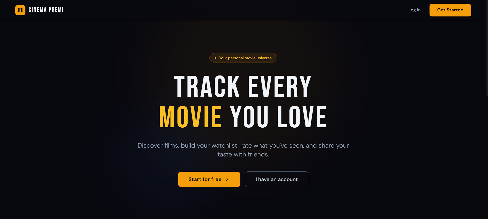
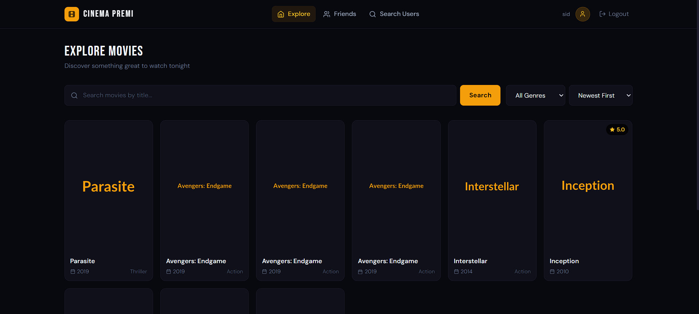
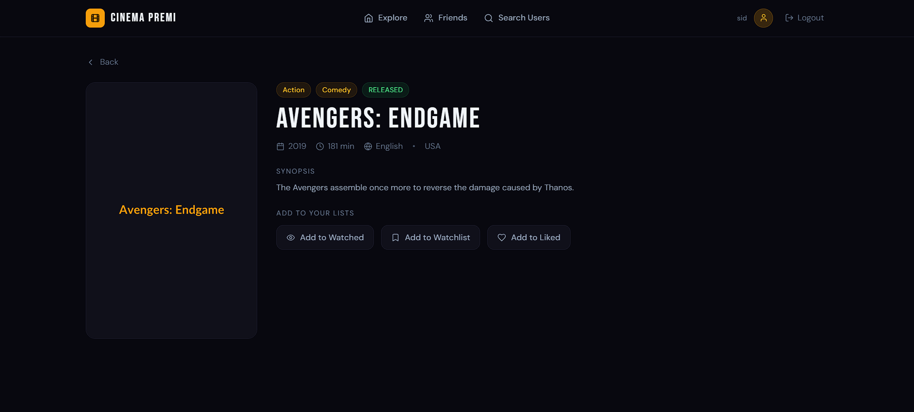
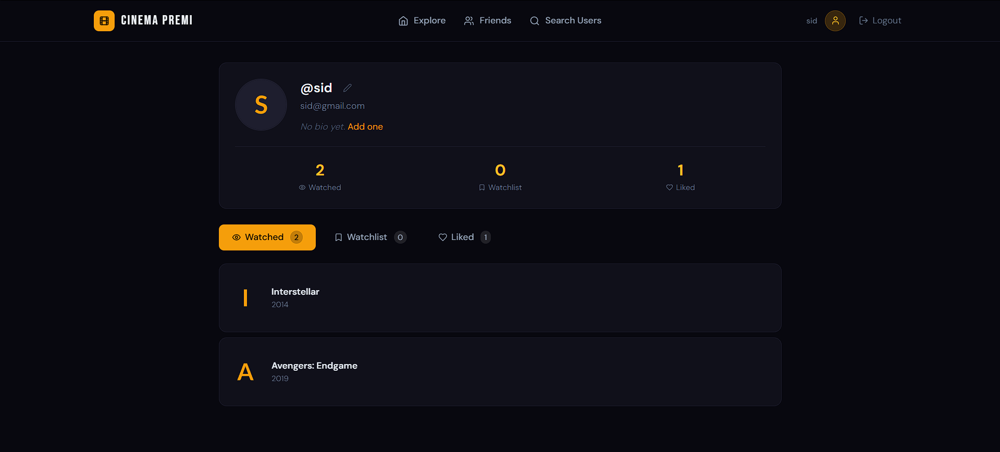
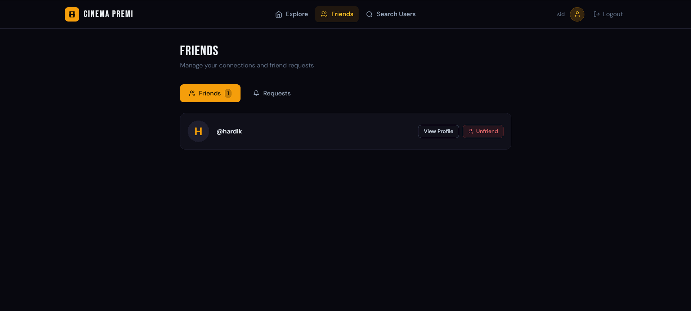
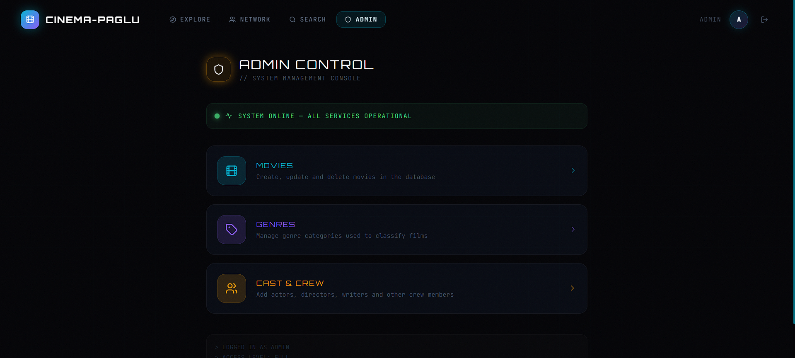

<div align="center">

# 🎬 CinemaApp

### *Your Personal Movie Universe*

[](https://spring.io/projects/spring-boot)
[](https://reactjs.org/)
[](https://www.mysql.com/)
[](https://jwt.io/)
[](https://tailwindcss.com/)

**Discover movies. Track what you've watched. Share with friends.**

[Features](#-features) • [Screenshots](#-screenshots) • [Tech Stack](#-tech-stack) • [Getting Started](#-getting-started) • [API Docs](#-api-endpoints) • [Project Structure](#-project-structure)

---

</div>

## ✨ Features

<table>
<tr>
<td width="50%">

**🎥 Movie Discovery**
- Browse all movies with pagination
- Search by title
- Filter by genre
- Sort by year, rating, or title

</td>
<td width="50%">

**📋 Personal Lists**
- Mark movies as **Watched**
- Save to **Watchlist**
- Add to **Liked** movies
- Same movie can be in multiple lists

</td>
</tr>
<tr>
<td width="50%">

**⭐ Ratings & Reviews**
- Rate movies on a **1–10 scale**
- Leave personal written reviews
- Community average rating auto-updates
- Only watchable after marking as Watched

</td>
<td width="50%">

**👥 Friends & Social**
- Send / accept / reject friend requests
- View friends' movie lists
- Privacy protected — lists visible to friends only
- Search for users by username

</td>
</tr>
<tr>
<td width="50%">

**🔐 Secure Authentication**
- JWT-based stateless auth
- BCrypt password hashing
- Auto token refresh handling
- Role-based access (USER / ADMIN)

</td>
<td width="50%">

**🛡️ Admin Panel**
- Full CRUD for Movies
- Manage Genres
- Manage Cast Members
- Admin-only protected routes

</td>
</tr>
</table>

---

## 📸 Screenshots

> **Landing Page**


---

> **Home — Explore Movies**


---

> **Movie Detail Page**


---

> **My Profile — Lists**


---

> **Friends Page**


---

> **Admin Panel**


---

## 🛠 Tech Stack

### Backend
| Technology | Purpose |
|---|---|
| Java 21 | Primary language |
| Spring Boot 3.x | Core backend framework |
| Spring Security + JWT | Authentication & authorization |
| Spring Data JPA + Hibernate | ORM — database interaction |
| MySQL 8.x | Relational database |
| Maven | Build tool & dependency management |
| Lombok | Boilerplate reduction |
| SpringDoc OpenAPI (Swagger) | API documentation |

### Frontend
| Technology | Purpose |
|---|---|
| React 18 | UI framework |
| Vite | Build tool & dev server |
| React Router DOM v6 | Client-side routing |
| Axios | HTTP client for API calls |
| Tailwind CSS | Utility-first styling |
| React Toastify | Toast notifications |
| Lucide React | Icon library |

---

## 🚀 Getting Started

### Prerequisites

Make sure the following are installed on your machine:

- **Java 21+** → `java -version`
- **Maven** → `mvn -version`
- **Node.js v18+** → `node -v`
- **MySQL 8+** → running locally

---

### 1. Clone the Repository

```bash
git clone https://github.com/yourusername/movieapp.git
cd movieapp
```

---

### 2. Set Up the Database

Open MySQL and run:

```sql
CREATE DATABASE movieapp;
```

---

### 3. Configure `application.properties`

Open `src/main/resources/application.properties` and update:

```properties
spring.datasource.url=jdbc:mysql://localhost:3306/movieapp
spring.datasource.username=your_mysql_username
spring.datasource.password=your_mysql_password

spring.jpa.hibernate.ddl-auto=update
spring.jpa.show-sql=true
spring.jpa.properties.hibernate.dialect=org.hibernate.dialect.MySQLDialect

jwt.secret=your_secret_key_minimum_32_characters_long
jwt.expiration=86400000

logging.level.org.springframework=INFO
logging.level.com.project.cinema=DEBUG
```

---

### 4. Run the Backend

```bash
mvn spring-boot:run
```

Backend starts on **`http://localhost:8080`**

---

### 5. Run the Frontend

Open a **second terminal**:

```bash
cd movieapp-frontend
npm install
npm run dev
```

Frontend starts on **`http://localhost:3000`**

---

### 6. Open the App

```
http://localhost:3000
```

---

### 7. Create an Admin User

Insert directly into MySQL to get admin access:

```sql
INSERT INTO users (username, email, password, role, is_active, created_at, updated_at)
VALUES (
  'admin',
  'admin@movieapp.com',
  '$2a$10$N9qo8uLOickgx2ZMRZoMyeIjZAgcfl7p92ldGxad68LzTFmi458W2',
  'ADMIN',
  true,
  NOW(),
  NOW()
);
```

> Password for this user is `admin123`

---

## 📡 API Endpoints

### Auth
| Method | Endpoint | Access | Description |
|--------|----------|--------|-------------|
| POST | `/api/auth/register` | Public | Register new user |
| POST | `/api/auth/login` | Public | Login and get JWT token |

### Movies
| Method | Endpoint | Access | Description |
|--------|----------|--------|-------------|
| GET | `/api/movies` | User | Get all movies (paginated) |
| GET | `/api/movies/{id}` | User | Get movie by ID |
| GET | `/api/movies/search?q=` | User | Search movies by title |
| POST | `/api/movies` | Admin | Create new movie |
| PUT | `/api/movies/{id}` | Admin | Update movie |
| DELETE | `/api/movies/{id}` | Admin | Delete movie |

### User Movie Lists
| Method | Endpoint | Access | Description |
|--------|----------|--------|-------------|
| POST | `/api/user-movies` | User | Add movie to a list |
| DELETE | `/api/user-movies/{movieId}/{listType}` | User | Remove from list |
| GET | `/api/user-movies/me/{listType}` | User | Get specific list |
| GET | `/api/user-movies/me/all` | User | Get all three lists |
| PUT | `/api/user-movies/{movieId}/rate` | User | Rate and review a movie |

### Friendships
| Method | Endpoint | Access | Description |
|--------|----------|--------|-------------|
| POST | `/api/friendships/request/{id}` | User | Send friend request |
| PUT | `/api/friendships/accept/{id}` | User | Accept request |
| PUT | `/api/friendships/reject/{id}` | User | Reject request |
| DELETE | `/api/friendships/{id}` | User | Unfriend |
| GET | `/api/friendships/me` | User | Get friends list |
| GET | `/api/friendships/pending` | User | Get pending requests |
| GET | `/api/friendships/{id}/lists/{listType}` | User | View friend's list |

> 📖 Full interactive API docs available at `http://localhost:8080/swagger-ui.html` when the backend is running.

---

## 📁 Project Structure

```
movieapp/
│
├── src/                                  # Spring Boot backend
│   └── main/java/com/project/cinema/
│       ├── controller/                   # REST API endpoints
│       ├── service/                      # Business logic
│       ├── repository/                   # Database queries
│       ├── entity/                       # JPA entity classes
│       ├── dto/
│       │   ├── request/                  # Incoming API payloads
│       │   └── response/                 # Outgoing API responses
│       ├── security/                     # JWT + Spring Security
│       ├── exception/                    # Global error handling
│       └── config/                       # Swagger config
│
├── movieapp-frontend/                    # React frontend
│   └── src/
│       ├── api/                          # Axios API calls (one file per module)
│       ├── context/                      # AuthContext — global state
│       ├── components/                   # Reusable UI components
│       └── pages/
│           ├── LandingPage.jsx
│           ├── LoginPage.jsx
│           ├── RegisterPage.jsx
│           ├── HomePage.jsx
│           ├── MovieDetailPage.jsx
│           ├── MyProfilePage.jsx
│           ├── FriendProfilePage.jsx
│           ├── FriendsPage.jsx
│           ├── SearchUsersPage.jsx
│           └── admin/
│               ├── AdminPanel.jsx
│               ├── AdminMovies.jsx
│               ├── AdminGenres.jsx
│               └── AdminCastMembers.jsx
│
├── .gitignore
├── pom.xml
└── README.md
```

---

## 🗄️ Database Schema

```
users ──────────────── user_movie_list ──────────────── movies
  │                                                       │
  │                                                       ├── movie_genre ── genres
  ├── friendships                                         │
  │   (requester_id, addressee_id, status)                └── movie_cast ── cast_members
  │
  └── (one user → many list entries)
```

---

## 🔐 Environment Variables

| Variable | Description |
|---|---|
| `spring.datasource.url` | MySQL connection URL |
| `spring.datasource.username` | MySQL username |
| `spring.datasource.password` | MySQL password |
| `jwt.secret` | Secret key for signing JWT tokens (min 32 chars) |
| `jwt.expiration` | Token expiry in milliseconds (86400000 = 24 hours) |

> ⚠️ **Never commit real credentials to GitHub.** Use placeholder values in the committed `application.properties`.

---

## 👨‍💻 Author

**Your Name**
- GitHub: [@yourusername](https://github.com/yourusername)

---

<div align="center">

Made with ❤️ using Spring Boot + React

</div>
